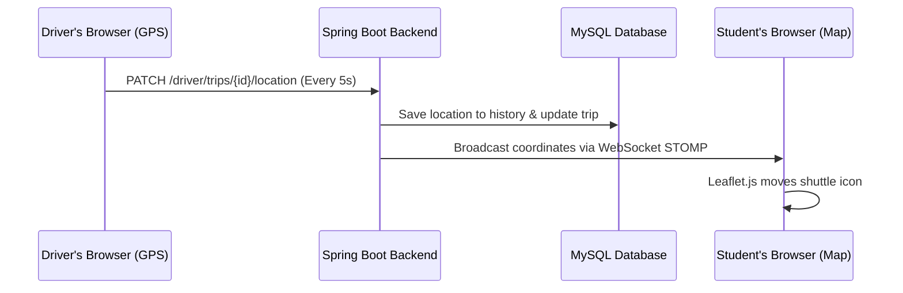

# Campus 360: Live Shuttle Tracking Workflow

This document outlines the complete end-to-end architecture and workflow for the Live Shuttle Tracking feature, using the HTML5 Geolocation API, Spring Boot WebSockets, and Leaflet.js.

## 1. High-Level Architecture

> [!TIP]
> **No External Map APIs Required for Tracking:** The tracking relies entirely on native browser features (`navigator.geolocation`) and our own WebSocket infrastructure. Leaflet.js and OpenStreetMap are only used for visual rendering on the student's end.

---

## 2. University Authority Workflow (Setup)

Before any tracking can happen, the university administration must configure the routes.

1. **Create Routes:** Authority navigates to the Admin Dashboard and creates a new `ShuttleRoute` (e.g., "North Campus Loop").
2. **Define Stops:** Authority drops pins on the map to define the coordinates and sequence of `RouteStops`.
3. **Register Drivers:** Authority registers Driver accounts and assigns them credentials.

---

## 3. The Driver Workflow (Data Generation)

The driver is responsible for generating the live GPS data while moving.

1. **Login & Select Route:** The driver logs in on their mobile browser and selects which route they are driving today.
2. **Start Trip:** The driver clicks the "Start Trip" button. 
   - A `POST /api/v1/driver/trips` request is sent to create a new `ShuttleTrip` in the database with status `active`.
3. **Continuous Tracking:**
   - The frontend Javascript triggers `navigator.geolocation.watchPosition()`.
   - The phone's GPS hardware continuously calculates latitude, longitude, speed, and heading.
   - Every few seconds, the Javascript sends a `PATCH /api/v1/driver/trips/{id}/location` request to the backend containing these coordinates.
4. **End Trip:** The driver arrives at the final destination and clicks "End Trip". The backend marks the trip as `completed`.

---

## 4. The Backend Workflow (Data Processing & Routing)

The Spring Boot backend acts as the central router for the GPS data.

1. **Receive Coordinates:** The `ShuttleDriverController` receives the `PATCH` request with the latest coordinates.
2. **Database Updates:**
   - **History Log:** It inserts a new row into `shuttle_locations` (for historical auditing).
   - **Current State:** It updates the `current_latitude` and `current_longitude` on the `shuttle_trips` table (for fast "where is it right now" lookups).
3. **WebSocket Broadcast:** The service layer immediately takes the new coordinates and uses `SimpMessagingTemplate` to broadcast a JSON message to a STOMP topic (e.g., `/topic/trips/15`).

---

## 5. The Student Workflow (Data Consumption & Visualization)

The student simply views the map and watches the shuttle move.

1. **Load Map:** The student opens the "Shuttle Map" page. Leaflet.js initializes and loads free map tiles from OpenStreetMap.
2. **Fetch Active Trips:** The page calls `GET /api/v1/shuttle-trips/active` to find out where the buses currently are. Leaflet places initial markers on the map.
3. **Subscribe to WebSocket:** The frontend Javascript connects to `/ws/shuttle-tracking` and subscribes to the specific trip's topic (`/topic/trips/15`).
4. **Real-Time Animation:** 
   - Whenever the backend broadcasts new coordinates, the student's browser receives the WebSocket message instantly.
   - Javascript tells Leaflet.js to smoothly animate the bus marker from its current position to the new latitude and longitude.

> [!NOTE]
> If a student disconnects or loses signal, they can simply refresh the page. Step 2 (Fetching active trips) will guarantee they immediately see the latest cached location of the bus before the WebSocket stream resumes.

---

## 6. Frontend Implementation

### 6.1. Libraries and Setup
Since we decided to use free, open-source mapping without API keys, we will use Leaflet.js along with SockJS and STOMP for WebSocket connections.
- We will include Leaflet CSS & JS via CDN.
- We will include SockJS and STOMP JS via CDN.

### 6.2. Driver Interface (`driver-panel.html`)
A standalone interface specifically designed for Drivers to use on their mobile browsers while driving.
- **`frontend/driver-panel.html`**: A clean, mobile-friendly interface for the driver. Contains a basic login form for the driver (using `driver@campus360.edu`), a dropdown to select which `ShuttleRoute` they are driving, and prominent "Start Trip" / "End Trip" buttons.
- **`frontend/js/driver.js`**: Contains the login logic utilizing the backend `/api/v1/auth/driver/login`. Implements `navigator.geolocation.watchPosition()` to listen for GPS changes and sends a `PATCH` request to `/api/v1/driver/trips/{tripId}/location` every time the phone reports a new GPS coordinate.

### 6.3. Student Map Interface (`shuttle.html`)
The main student-facing map embedded within the standard Campus 360 dashboard layout.
- **`frontend/shuttle.html`**: Cloned from the standard dashboard layout (includes the sidebar and top navbar). Contains a large `div id="map"` container for Leaflet.js and a side-panel listing the active routes.
- **`frontend/css/shuttle.css`**: Specific styles for sizing the map and making the shuttle marker popup look premium and aesthetic.
- **`frontend/js/shuttle.js`**:
  - **Initialization:** Fetches all active trips via `GET /api/v1/shuttle-trips/active` to place initial bus icons on the map.
  - **WebSocket Connection:** Uses SockJS to connect to `http://localhost:8080/ws/shuttle-tracking`.
  - **Live Updates:** Subscribes to `/topic/trips/{tripId}`. When a message is received, it uses Leaflet's `setLatLng()` to instantly move the bus icon to the new position.

### 6.4. Updating Navigation
- **`frontend/dashboard.html`**: Update the sidebar link for "Shuttle Tracking" to point to `shuttle.html`.
